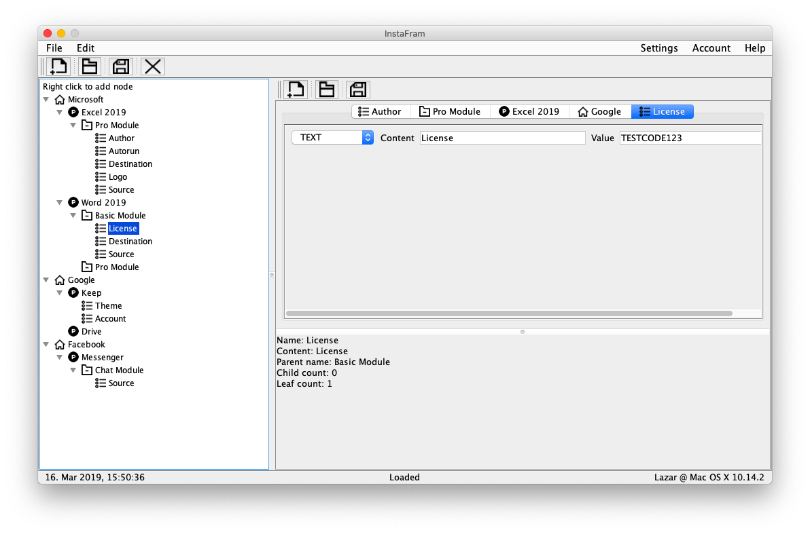

# 1. Overview

## 1.1. Problem

Different programs require different installation methods. It is necessary to enable the handling of installations in a unique way using one tool that saves time and money.

## 1.2. Interested parties

Software companies that have a large number of sales programs. They have a problem writing the installations over and over again for each project.

## 1.3. Solution

InstaFram is an installation framework that allows their users to create custom installations and make them flexible. This tool is helpful in solving software installation issues. This tool offers:

* Handling software products
* Description, definition and permanent storage of the architecture of an arbitrary software product
* Handling the configuration of software products
* Handling instances of software architecture architecture
* Handling parameters of the components of the software product architecture
* Client management (software companies)
* Operating installation packages (product, settings, installer, instructions)

# 2. Limitations

* Security - the internal components of the tool are not readable and easily accessible to the user
* Availability - the tool is ready for use at all times
* Portability - the tool can run without any disadvantages on different platforms (MacOS, Windows, Linux), with a consistent layout of UI elements and functionality, and a different "look and feel"
* Localization - the tool has the possibility of localization
* The work environment of the tool is presented through the graphical user interface (GUI)
* The successful use of the tool does not require the purchase or development of additional hardware components

# 3. Terms

* Flexible installation - an installation that adjusts to another product by changing the parameters
* Framework (framework) - a conceptual structure that serves as a support for making something that extends its structure into something useful
* Localization - customizing a product or service to meet the needs of a specific language or culture

# 4. PowerDesigner models

[Requirement Model](https://github.com/jelic98/instafram/blob/master/RequirementsModel.rqm)

[Object Oriented Model](https://github.com/jelic98/instafram/blob/master/ObjectOrientedModel.oom)
